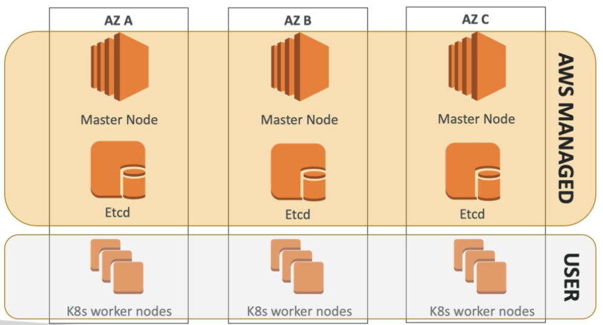
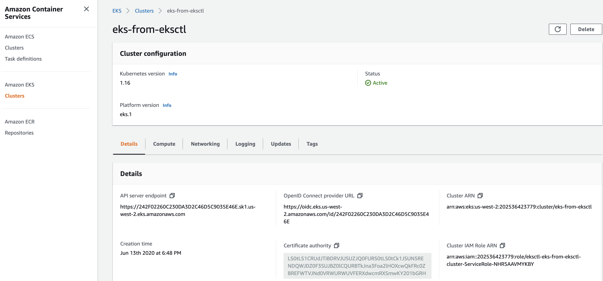

# 2. Set Up EKS 1.20 cluster with eksctl in 15 minutes


# 2.1 Create AWS IAM user, access key, and EKS cluster IAM role from Console

Create a free account first
```
https://aws.amazon.com/resources/create-account/
```


# 2.2 Install AWS cli
Ref: https://docs.aws.amazon.com/cli/latest/userguide/install-cliv2.html
```bash

aws --version

# create "eks-demo" profile
aws configure --profile eks-demo

aws sts get-caller-identity
```

## Create AWS Profile
In production environment, it's easier to swtich to different AWS IAM user or IAM role identiy by `export AWS_PROFILE=PROFILE_NAME`.

Instead of using `default` profile created by above `aws configure`, you can create a named AWS Profile `eks-demo` in two ways:

1. `aws configure --profile eks-demo`
2. create profile entry in `~/.aws/credentials` file


To create profile entry in `~/.aws/credentials` file, do the followings:
```
vim ~/.aws/credentials
```
Enter `i` key and paste below lines into the file
```
[eks-demo] 
aws_access_key_id=YOUR_ACCESS_KEY 
aws_secret_access_key=YOUR_SECRET_ACCESS_KEY
aws_region = YOUR_REGION 
```

Hit `escape`key and type `:wq!` to save and exit out from Vim.

Then check if new profile can be authenticated
```sh
export AWS_PROFILE=eks-demo

# successful output
aws sts get-caller-identity
{
    "UserId": "xxxxxxxxx",
    "Account": "12321313123131",
    "Arn": "arn:aws:iam::1231231231231:user/eks-demo"
}
```


# 2.3 Install aws-iam-authenticator (if aws cli is 1.20.156 or earlier)
```bash

# Windows
# install chocolatey first: https://chocolatey.org/install
choco install -y aws-iam-authenticator
```

# 2.4 Install kubectl
Ref: https://kubernetes.io/docs/tasks/tools/install-kubectl/
```bash
# Windows
choco install kubernetes-cli

kubectl version
```

# 2.5 Install eksctl
Ref: https://docs.aws.amazon.com/eks/latest/userguide/getting-started-eksctl.html
```bash

# Windows: https://docs.aws.amazon.com/eks/latest/userguide/eksctl.html
# install chocolatey first
https://chocolatey.org/install

# instakk eskctl from chocolatey
chocolatey install -y eksctl 
eksctl version
```

# 2.6 Create ssh key for EKS worker nodes
```bash
$ ssh-keygen
    Generating public/private rsa key pair.
    Enter file in which to save the key (/c/Users/koarumug/.ssh/id_rsa): eks_worker_nodes_demo.pem
    Enter passphrase (empty for no passphrase): 
    Enter same passphrase again: 
    Your identification has been saved in eks_worker_nodes_demo.pem
    Your public key has been saved in eks_worker_nodes_demo.pem.pub
    The key fingerprint is:
    SHA256:NttiGn1ln82HU+voWjk/T/DLtld4Oap6J4lFhX6Ixe8 koarumug@INLEN8520040198
    The key's randomart image is:
    +---[RSA 3072]----+
    |          . .    |
    |           + .   |
    |          + +    |
    |         . + o   |
    |        S . = ..o|
    |       o + + Eo@+|
    |      . = = .+*oO|
    |       + + +.o*=+|
    |      .  .oo*o.**|
    +----[SHA256]-----+

$ ll
    -rw-r--r-- 1 koarumug 1049089 2610 Sep 22 11:35  eks_worker_nodes_demo.pem
    -rw-r--r-- 1 koarumug 1049089  578 Sep 22 11:35  eks_worker_nodes_demo.pem.pub

$ mv eks_work* ~/.ssh/

$ ls -ltar ~/.ssh
    -rw-r--r-- 1 koarumug 1049089  819 Sep 19 17:21 known_hosts.old
    -rw-r--r-- 1 koarumug 1049089 2610 Sep 19 17:23 id_rsa
    -rw-r--r-- 1 koarumug 1049089  578 Sep 19 17:23 id_rsa.pub
    -rw-r--r-- 1 koarumug 1049089 1555 Sep 19 17:24 known_hosts
    drwxr-xr-x 1 koarumug 1049089    0 Sep 22 11:30 ../
    -rw-r--r-- 1 koarumug 1049089 2610 Sep 22 11:35 eks_worker_nodes_demo.pem
    -rw-r--r-- 1 koarumug 1049089  578 Sep 22 11:35 eks_worker_nodes_demo.pem.pub


```

# 2.7 Setup EKS cluster with eksctl (so you don't need to manually create VPC)
`eksctl` tool will create K8s Control Plane (master nodes, etcd, API server, etc), worker nodes, VPC, Security Groups, Subnets, Routes, Internet Gateway, etc.
```bash
# use official AWS EKS AMI
# dedicated VPC

eksctl create cluster \
    --name eks-from-eksctl \
    --version 1.25 \
    --region us-east-1 \
    --nodegroup-name workers \
    --node-type t2.medium \
    --nodes 1 \
    --nodes-min 1 \
    --nodes-max 1 \
    --ssh-access \
    --ssh-public-key ~/.ssh/eks_worker_nodes_demo.pem.pub \
    --managed
```

Once you have created a cluster, you will find that cluster credentials were added in ~/.kube/config

```bash
# Verify AWS Credentials
cat ~/.aws/credentials
export AWS_PROFILE=eks-demo
aws sts get-caller-identity

# get info about cluster resources
aws eks describe-cluster --name eks-from-eksctl --region us-east-1
```


```bash
# get services
kubectl get svc
```

Output shows the default `kubernetes` service, which is the API server in master node
```bash
NAME         TYPE        CLUSTER-IP   EXTERNAL-IP   PORT(S)   AGE
kubernetes   ClusterIP   10.100.0.1   <none>        443/TCP   38m
```

# 2.8 AWS Networking Basics Overview - Region, AZ, VPC and Subnet


Master (AWS manages this, hence master nodes not visible in Console):
- three master nodes for HA
- security group for masters
- IAM role and instance profile for master nodes

Worker:
- arbitrary # of worker nodes
- auto scaling group (ASG)
- launch config for ASG (launch config is a template for ASG)
- security group for workers
- IAM role and instance profile for workers

AWS VPC:
- VPC
- Subnets for three availability zones (AZ) for us-west-2 region
- Route tables with routes
- Internet Gateway
- NAT gateway

Shared responsibility model for EKS 



# 2.9 EKS Console Walkthrough



# 2.10 Delete EKS Cluster:

```bash
eksctl delete cluster \
    --name eks-from-eksctl \
    --region us-east-1 
```    