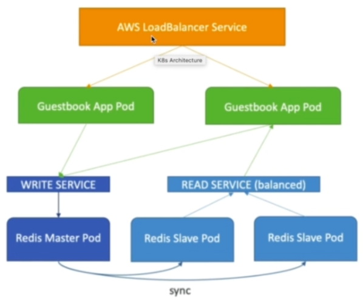
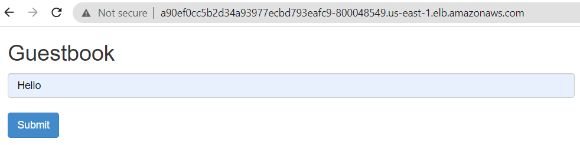
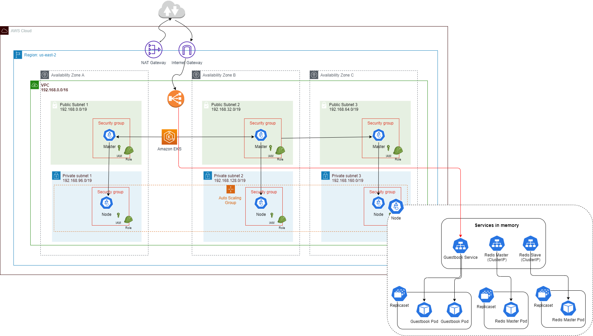

# 5. Deploy Sample App to EKS

Refs: 
- https://github.com/kubernetes/examples/tree/master/guestbook



Frontend PHP app
- load balanced by public ELB
- read request load balanced to multiple slaves
- write request to a single master

Backend Redis
- single master (write)
- multi slaves (read)
- slaves sync continuously from master

# 5.1 Deploy Redis Master (Deprecated - DON'T Use)
```
kubectl apply -f https://raw.githubusercontent.com/kubernetes/examples/master/guestbook-go/redis-master-controller.json

kubectl apply -f https://raw.githubusercontent.com/kubernetes/examples/master/guestbook-go/redis-master-service.json
```

# 5.2 Deploy Redis Slave (Deprecated - DON'T Use)
```
kubectl apply -f https://raw.githubusercontent.com/kubernetes/examples/master/guestbook-go/redis-slave-controller.json

kubectl apply -f https://raw.githubusercontent.com/kubernetes/examples/master/guestbook-go/redis-slave-service.json
```

# 5.3 Deploy frontend app (Deprecated - DON'T Use)
```
kubectl apply -f https://raw.githubusercontent.com/kubernetes/examples/master/guestbook-go/guestbook-controller.json

kubectl apply -f https://raw.githubusercontent.com/kubernetes/examples/master/guestbook-go/guestbook-service.json
```

# 5.3 Deploy frontend app (Download the raw YAML)
```
kubectl apply -f https://raw.githubusercontent.com/kubernetes/examples/master/guestbook/all-in-one/guestbook-all-in-one.yaml

```


Get service and pod
```
kubectl get pod,service
```

Output
```
NAME                                 READY   STATUS    RESTARTS   AGE
pod/frontend-6c6d6dfd4d-lcswx        1/1     Running   0          3m24s
pod/frontend-6c6d6dfd4d-mhkkd        1/1     Running   0          3m24s
pod/frontend-6c6d6dfd4d-qllsb        1/1     Running   0          3m24s
pod/redis-master-f46ff57fd-w82fp     1/1     Running   0          3m28s
pod/redis-replica-7bc488654d-bkzsx   1/1     Running   0          3m26s
pod/redis-replica-7bc488654d-s7lmj   1/1     Running   0          3m26s

NAME                    TYPE        CLUSTER-IP      EXTERNAL-IP   PORT(S)        AGE
service/frontend        NodePort    10.100.17.225   <none>        80:30733/TCP   3m26s
service/kubernetes      ClusterIP   10.100.0.1      <none>        443/TCP        57m
service/redis-master    ClusterIP   10.100.245.1    <none>        6379/TCP       3m30s
service/redis-replica   ClusterIP   10.100.21.227   <none>        6379/TCP       3m28s
```

# Change Frontend service type from NodePort to LoadBalancer
```
kubectl apply -f guestbook-all-in-one.yaml

kubectl get services
```
Output
```
NAME            TYPE           CLUSTER-IP      EXTERNAL-IP                                                              PORT(S)        AGE
frontend        LoadBalancer   10.100.17.225   a90ef0cc5b2d34a93977ecbd793eafc9-800048549.us-east-1.elb.amazonaws.com   80:30733/TCP   11m
kubernetes      ClusterIP      10.100.0.1      <none>                                                                   443/TCP        65m
redis-master    ClusterIP      10.100.245.1    <none>                                                                   6379/TCP       11m
redis-replica   ClusterIP      10.100.21.227   <none>                                                                   6379/TCP       11m
```
# 5.4 Get external ELB DNS
```
$ echo $(kubectl  get svc frontend | awk '{ print $4 }' | tail -1):$(kubectl  get svc frontend | awk '{ print $5 }' | tail -1 | cut -d ":" -f 1)

a90ef0cc5b2d34a93977ecbd793eafc9-800048549.us-east-1.elb.amazonaws.com:80
```

Visit it from browser __after 3-5 minutes when ELB is ready__




# 5.5 What Just Happened?!



#### How to Uninstall all the resources (don't do it yet, as we will expose these pods with Ingress in the next chapter)
```
kubectl delete -f guestbook-all-in-one.yaml
```